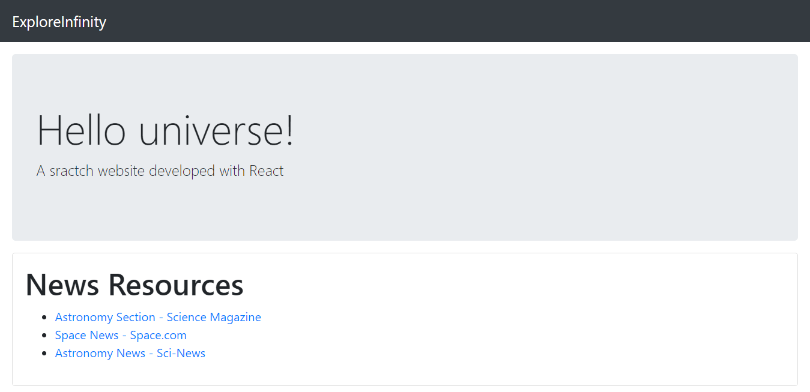

# ExploreInfinity
Website/Directorio de prueba desarrollado en ReactJS para descubrir un poco más el cosmos a través de enlaces a noticias.


## ⚙️ Estructura
La estructura del proyecto fue desarrollada automáticamente `npx create-react-app`.

## 📦 Deployment
Una vez el proyecto ha sido clonado/descargado. Abre la terminal dentro de la carpeta y, con [NodeJS](https://nodejs.org/en/) instalado en el ordenador, sólo ejecuta el comando
```
npm start
```
